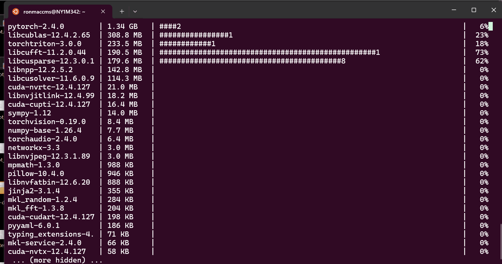
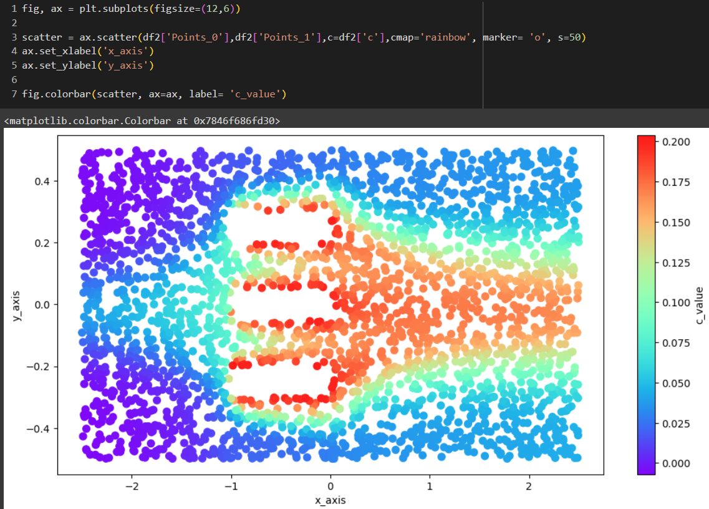
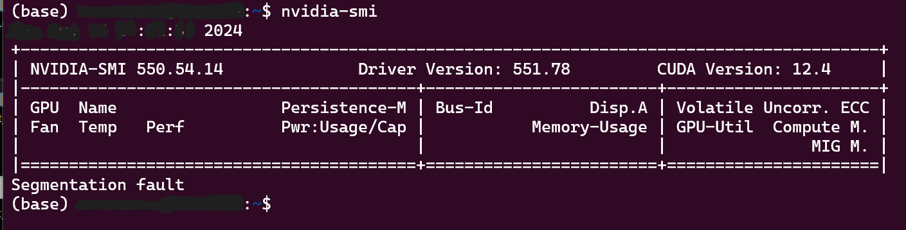

<!-- PROJECT LOGO -->

  WIP

 

    
  <h3 align="center">Urban Wind Flow Modeling with PINNs</h3>
  
IAAC: AI 2023-24 
    <a href="mailto:andres.roncal@students.iaac.net" target="_blank">Report Bug</a>
    ·
    <a href="mailto:andres.roncal@students.iaac.net" target="_blank">Request Feature</a>
  

  <!-- Add a link to the research paper -->
  

    <a href="https://docs.google.com/document/d/1bncJg6RVQCD4ev0K-jJk0_dyS2iHdrlpaUodtdLf9TM/edit" target="_blank">
      View Research Paper
    </a>
  

<!-- GIF Section -->

  

<h2>About The Project</h2>

Project developed under the course IAAC: AI 2023-24 in <a href="https://iaac.net/">IAAC</a>.

<h3>Overview</h3>

This study specifically explores Physics-Informed Neural Networks (PINNs) and Computational Fluid Dynamics (CFD) to analyze pedestrian wind comfort. It aims to integrate these neural network models into a web application using Three.js and other tools. By utilizing data from OpenWeatherMap, and OpenStreetMap, the project aims to support real-time simulations and visualizations of wind flow in urban environments.

<h3>Objectives</h3>

<ul>
  <li>Research and develop Physics-Informed Neural Networks (PINNs) for Computational Fluid Dynamics (CFD) to analyze pedestrian wind comfort in urban environments.</li>
  <li>Collect and preprocess real-time wind data from OpenWeatherMap and 3D building models from OpenStreetMap using the Overpass API to create accurate simulations.</li>
  <li>Generate 3D geometries for Modulus Sym analysis, utilizing polygons to represent building footprints within the simulation environment.</li>
  <li>Train and optimize the PINN model using NVIDIA Modulus and PyTorch to simulate urban wind flow dynamics.</li>
  <li>Integrate the trained neural network model into a web application using Vue.js and Three.js to provide real-time interaction and visualizations.</li>
  <li>Facilitate the open-source nature of the project to support urban planners, architects, and researchers, offering insights that enhance urban design and pedestrian comfort.</li>
</ul>

<h3>Significance</h3>

This project aims to create an open-source platform that provides access to tools and information for analyzing urban wind flow using advanced NN models. By developing this platform, the project:

<ul>
  <li>Facilitates open access to simulation tools for urban wind flow analysis, allowing users, researchers, and developers to explore the potential of neural networks in urban environments.</li>
  <li>Promotes the use of Physics-Informed Neural Networks (PINNs) and Computational Fluid Dynamics (CFD) as accessible methods for assessing pedestrian comfort and sustainable urban design.</li>
  <li>Encourages community-driven growth by offering potential tutorial series, educational content, and guides for using the software tools integrated into the platform, including NVIDIA Modulus, PyTorch, and Three.js.</li>
</ul>

<h3>Methodology</h3>

Phases:

<ol>
  <li><strong>Planning</strong>: Define the project scope, set up the repository, and outline the research goals. Collect and preprocess real-time wind data from OpenWeatherMap and building geometry from OpenStreetMap using the Overpass API.</li>
  <li><strong>Data Integration</strong>: Integrate real-time wind data and 3D building models to represent urban environments accurately for simulations.</li>
  <li><strong>3D Geometry Generation</strong>: Develop 3D geometries using polygons to represent building footprints.</li>
  <li><strong>PINN Model Development</strong>: Conduct research and testing using PyTorch. Develop and optimize the PINN model with NVIDIA’s Modulus framework to simulate wind flow dynamics in urban environments.</li>
  <li><strong>Frontend Development</strong>: Create a web-based user interface using Vue.js to allow real-time simulations. Employ Three.js for 3D visualization and Geolib.</li>
  <li><strong>System Integration and Testing</strong>: Integrate the frontend, backend, and neural network model.</li>
  <li><strong>Deployment and Documentation</strong>: Deploy the application as an open-source web platform. Document the research, development process, and usage guidelines to assist future users. Plan for tutorial series and educational content to further facilitate access to the software and methodologies used in this project.</li>
</ol>

<h3>Data Sources</h3>
<ul>
  <li><strong>Real-Time Wind Data</strong>: OpenWeatherMap wind conditions.</li>
  <li><strong>3D Building Models</strong>: OpenStreetMap (OSM) data using Overpass API.</li>
</ul>

<h3>Equations and Models</h3>

The simulation of urban wind flow in this project is based on the Navier-Stokes equations, which govern the motion of fluid substances. To incorporate the urban geometries and building footprints into the simulations, the model defines boundary conditions derived from the 3D building data sourced from OpenStreetMap.

Physics-Informed Neural Networks (PINNs) are used to solve the Navier-Stokes equations, embedding the physical laws of fluid dynamics into the neural network’s architecture. During training, the model minimizes the residuals of these equations alongside data-driven loss components, which should include wind data from OpenWeatherMap. The Advection-Diffusion equation is also considered for modeling the transport of environmental variables like temperature.

Inverse PINNs (I-PINNs) and Deep Neural Operators (DeepONets) are explored to optimize the model’s parameters and enhance its ability to simulate real-world scenarios accurately. These approaches allow the neural network to generalize to different urban contexts while maintaining adherence to the governing physical equations. NVIDIA Modulus and PyTorch are employed to facilitate the implementation and optimization of these models for efficient simulation testing on GPUs.

<!-- GIF Section -->

  

<h3>Frontend Development</h3>

The frontend is developed using Vue.js, with Three.js handling the 3D rendering and Geolib managing geographic calculations. This interface allows users to input geographical data and run wind flow simulations, providing immediate visual feedback.

<h3>Learning and Development with NVIDIA Modulus Sym</h3>

As part of the development process for this project, I am actively learning how to leverage NVIDIA’s <code>modulus.sym</code> for building PINNs. The training sessions required for developing accurate models often take up to 12 hours, and they are conducted on my GPU using a WSL. This setup allows me to fully utilize the computational power of my NVIDIA GPU while working in a Linux environment.

    

<h3>Testing Different Techniques</h3>

Throughout the research, various techniques were explored to optimize the simulation of urban wind flow:
 
<ul> 
  <li><strong>Physics-Informed Neural Networks (PINNs)</strong>: Implemented PINNs to embed the Navier-Stokes and Advection-Diffusion equations into the neural network architecture. This involved training the model to minimize the residuals of these governing equations, allowing for accurate simulation of fluid dynamics within the urban context.</li> 

  <li><strong>Inverse PINNs (I-PINNs)</strong>: Utilized I-PINNs to address inverse problems, enabling the optimization of model parameters using observed data. This method was particularly useful in fine-tuning the simulation to reflect real-world wind conditions and interactions with urban geometries.</li> 

  <li><strong>Deep Neural Operators (DeepONets)</strong>: Investigated DeepONets to develop a framework for mapping functions to functions, providing an efficient means of solving complex simulations. This technique is being tested to handle varying boundary conditions.</li> 

  <li><strong>NVIDIA Modulus</strong>: Leveraged NVIDIA’s Modulus framework for the implementation and optimization of PINNs and DeepONets. Modulus provided support for GPU-accelerated training, significantly improving the computational efficiency of the simulations. Experiments were conducted in both 2D and 3D geometries to validate the model's accuracy in capturing wind flow dynamics and its interaction with building structures.</li> 
</ul>

    

 

    

<h3>Current Status</h3>

The platform's front and back ends are fully integrated, allowing for user input, real-time data processing, and detailed 3D visualization. The final integration for pedestrian wind assessment is still in progress, with the focus shifting to an intensive period of research and testing using Physics-Informed Neural Networks (PINNs) and Deep Neural Operators (DeepONets).

The current research involves multiple stages of testing different methodologies:

<ul>
  <li><strong>PINNs</strong>: Started with basic simulations using PyTorch, moving through numerical solutions for 1D heat equations, Burgers' equations, and 2D Navier-Stokes simulations. Tested solutions using DeepXDE for both 1D and 2D models.</li>
  <li><strong>I-PINNs (Inverse PINNs)</strong>: Explored inverse problems and optimization strategies to fine-tune model parameters using techniques like the TVD method solution.</li>
  <li><strong>DeepONets</strong>: Investigated advanced neural operator techniques using PyTorch and DeepXDE for integration and fluid neural operator solutions.</li>
  <li><strong>NVIDIA PINNs</strong>: Leveraged NVIDIA Modulus for implementing models such as cavity flow, 2D wave equations, heat sink simulations, and stress analysis.</li>
  <li><strong>NVIDIA DeepONets</strong>: Further developed models to include 3D bracket stress analysis, multi-domain calculations, and geometric optimization using PINNs.</li>
</ul>

<h3>Setting Up and Using WSL for CUDA-Enabled GPU Computing</h3>

To fully utilize the NVIDIA GPU on my system, I have set up a WSL environment with Ubuntu 20.04, which allows me to run Linux-based software while taking advantage of CUDA for GPU. Below are the steps to replicate this setup:

    

<h3>Step 1: Install WSL and Ubuntu 20.04</h3>
<ol>
  <li><strong>Enable WSL</strong>: Open PowerShell as an Administrator and run:</li>
  <li><strong>Install Ubuntu 20.04</strong>: If you need a specific version, such as Ubuntu 20.04</li>
  <li><strong>Set Up WSL</strong>: Once Ubuntu is installed, open it from your Start menu and follow the on-screen instructions to complete the setup.</li>
</ol>

<h3>Step 2: Install NVIDIA CUDA Toolkit</h3>

<h3>Step 4: Install NVIDIA Modulus and Other Dependencies</h3>

<h2>Team & Contacts</h2>

<h3>Contributor</h3>

<strong>Andres Roncal</strong>

  (<a href="#readme-top">back to top</a>)

