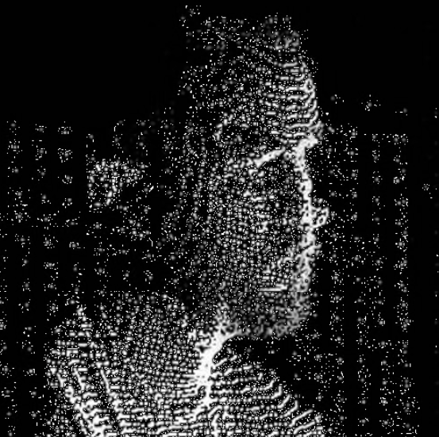

# macadThesis24

<!-- PROJECT LOGO -->
 

    
  <h3 align="center">Optimizing Building Facades for Cooling Using Wind Direction and Strength</h3>
  
IAAC: AI 2023-24 
    <a href="mailto:andres.roncal@students.iaac.net">Report Bug</a>
    ·
    <a href="mailto:andres.roncal@students.iaac.net">Request Feature</a>
  

## About The Project

Project developed under the course IAAC: AI 2023-24 in [IAAC](https://iaac.net/).

This thesis aims to design and optimize building facades to enhance cooling efficiency by leveraging data on wind direction and strength. The study will utilize AI-driven simulations, including Physics-Informed Neural Networks (PINNs), to create adaptive facade designs that respond dynamically to environmental conditions, thereby reducing energy consumption and improving indoor comfort. By developing a comprehensive web-based platform that integrates GIS data with simulations, this project seeks to improve decision-making processes in the AEC industry. The platform will allow architects, urban planners, and other stakeholders to input specific parameters such as location coordinates (latitude and longitude) and building geometry to assess current conditions and optimize facade designs accordingly. This approach facilitates more efficient and informed architectural planning and development by providing accessible geospatial data.

## Team & Contacts

### Student
**Andres Roncal**

- [LinkedIn](https://www.linkedin.com/in/andres-roncal-1b148a132/)

### Thesis Advisor
**David Andres Leon**

- [LinkedIn](https://es.linkedin.com/in/davidandresleon)

(<a href="#readme-top">back to top</a>)

