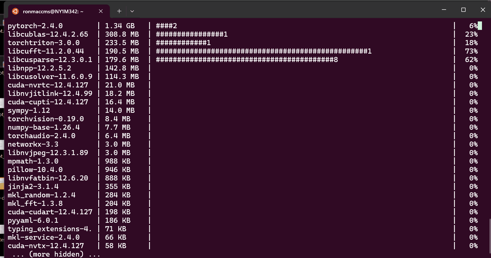
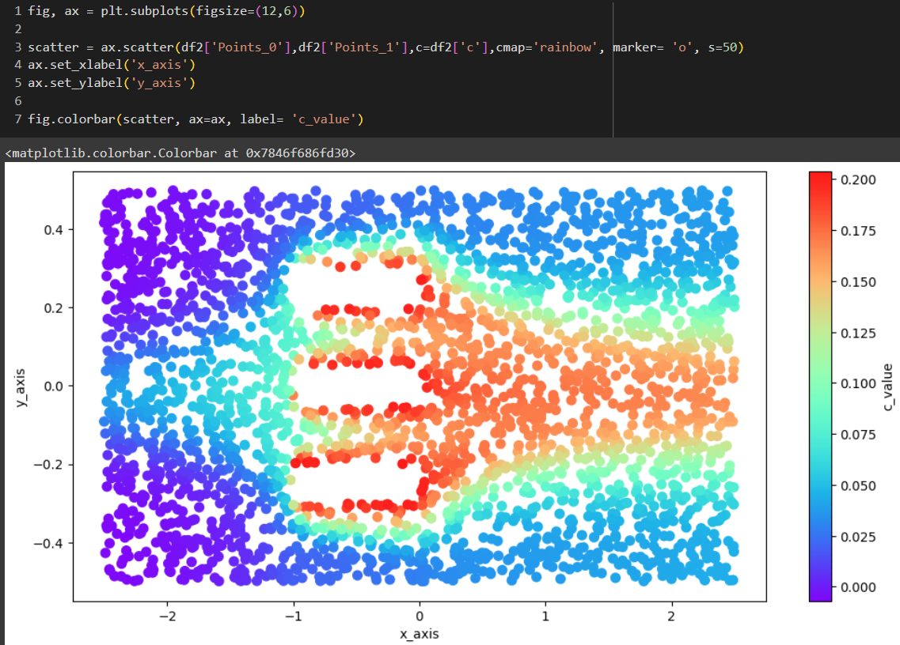
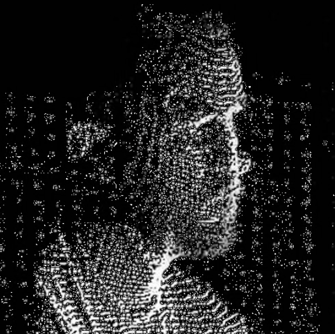

<!-- PROJECT LOGO -->
 

    
  <h3 align="center">Urban Wind Flow Modeling with PINNs</h3>
  
IAAC: AI 2023-24 
    <a href="mailto:andres.roncal@students.iaac.net">Report Bug</a>
    ·
    <a href="mailto:andres.roncal@students.iaac.net">Request Feature</a>
  

<!-- GIF Section -->

  

<h2>About The Project</h2>

Project developed under the course IAAC: AI 2023-24 in <a href="https://iaac.net/">IAAC</a>.

<h3>Overview</h3>

Urban Wind Flow Modeling with PINNs focuses on developing a web-based platform that simulates wind flow in urban environments using real-time data and neural networks. By using data from NOAA, OpenWeatherMap, and OpenStreetMap, the project integrates real-time wind data and 3D building models to visualize pedestrian wind comfort and cfd simulations.

<h3>Objectives</h3>

The projects aim is to create an open-source, web-based platform that leverages Physics-Informed Neural Networks to simulate wind flow in urban environments. Designed to be a collaborative tool, inviting contributions from urban planners, architects, and designers to enhance its functionality and adaptability. The project aims to promote sustainable urban development, reducing energy consumption and improving pedestrian comfort. This initiative not only supports environmental sustainability but also fosters a community-driven approach to urban design innovation.

<ul>
  <li>Collect and preprocess data from various sources, including historical wind data from NOAA, real-time wind conditions from OpenWeatherMap, and 3D building models from OpenStreetMap using the Overpass API.</li>
  <li>Develop and train a PINN model using NVIDIA Modulus and PyTorch to simulate wind flow.</li>
  <li>Integrate the trained model into a Vue.js application for real-time user interaction and visualization.</li>
  <li>Provide insights and visualizations to urban planners and architects to enhance urban design and pedestrian comfort.</li>
  <li>Utilize Three.js and Geolib for rendering and geographic calculations respectively, as implemented in the <code>space.vue</code> component.</li>
</ul>

<h3>Significance</h3>

By reducing reliance on mechanical cooling systems and improving outdoor conditions, this project aims to:

<ul>
  <li>Enhance the sustainability of urban environments.</li>
  <li>Reduce energy consumption and operational costs.</li>
</ul>

<h3>Methodology</h3>

Phases:

<ol>
  <li><strong>Planning</strong>: Set repository and collect data from NOAA, OpenWeatherMap, and OpenStreetMap for model development.</li>
  <li><strong>PINN Model Development</strong>: Utilize PyTorch for initial testing and develop the PINN model using NVIDIA’s Modulus framework.</li>
  <li><strong>Backend Development</strong>: Implement the backend using Flask or FastAPI, creating API endpoints to manage data and run simulations.</li>
  <li><strong>Frontend Development</strong>: Develop the user interface using Vue.js, with Three.js for 3D rendering and Geolib for geographic calculations.</li>
  <li><strong>System Integration and Testing</strong>: Connect the frontend, backend, and PINN model, followed by rigorous testing to ensure accuracy and reliability.</li>
  <li><strong>Deployment and Documentation</strong>: Deploy the application on a cloud platform and document the project for future reference.</li>
</ol>

<h3>Data Sources</h3>
<ul>
<!--   <li><strong>Historical Wind Data</strong>: NOAA historical wind speed and direction data.</li> -->
  <li><strong>Real-Time Wind Data</strong>: OpenWeatherMap wind conditions.</li>
  <li><strong>3D Building Models</strong>: OpenStreetMap (OSM) data using Overpass API.</li>
<!--   <li><strong>Synthetic Data</strong>: Ladybug Tools for additional modeling.</li> -->
</ul>

<h3>Equations and Models</h3>

The challenges include the ongoing integration of the OpenWeatherMap data and Navier-Stokes equations into the neural network model to enhance the precision of simulations.

<!-- GIF Section -->

  

<h3>Frontend Development</h3>

The frontend is developed using Vue.js, with Three.js handling the 3D rendering and Geolib managing geographic calculations. This interface allows users to input geographical data and run wind flow simulations, providing immediate visual feedback.

<h3>System Integration</h3>

The system integration phase involved connecting the backend, frontend, and PINN model.

<h3>Learning and Development with NVIDIA Modulus Sym</h3>

As part of the development process for this project, I am actively learning how to leverage NVIDIA’s <code>modulus.sym</code> for building PINNs. The training sessions required for developing accurate models often take up to 12 hours, and they are conducted on my GPU using a WSL. This setup allows me to fully utilize the computational power of my NVIDIA GPU while working in a Linux environment.

    

I am testing several techniques:
 
<ul> 
    <li><strong>Physics-Informed Neural Networks (PINNs)</strong>: Learning how to integrate physical laws directly into neural networks for accurate simulation results.
    </li> 
    <li><strong>Inverse PINNs (I-PINNs)</strong>: Tackling inverse problems to optimize and fine-tune model parameters based on observed data.
    </li> 
    <li><strong>Deep Neural Operators (DeepONets)</strong>: Developing skills in mapping functions to functions, for solving complex simulations like fluid dynamics.
    </li> 
    <li><strong>NVIDIA Modulus</strong>: Applying these concepts using NVIDIA’s Modulus framework, specifically in Computational Fluid Dynamics (CFD) and structural analysis.
    </li> 
</ul>

    

 

    

<h3>Example of Implementation</h3>

2D simulation in Section 3: Deep Neural Operator (DeepONet). This simulation integrates key equations such as the Navier-Stokes and Advection-Diffusion equations to model fluid dynamics. By utilizing <code>modulus.sym</code>, I have been able to develop neural networks that predict fluid velocity, pressure, and diffusivity, for simulating wind flow in urban environments.

<h3>Setting Up and Using WSL for CUDA-Enabled GPU Computing</h3>

To fully utilize the NVIDIA GPU on my system, I have set up a WSL environment with Ubuntu 20.04, which allows me to run Linux-based software while taking advantage of CUDA for GPU. Below are the steps to replicate this setup:

    

<h3>Step 1: Install WSL and Ubuntu 20.04</h3>
<ol>
  <li><strong>Enable WSL</strong>: Open PowerShell as an Administrator and run:
  </li>
  <li><strong>Install Ubuntu 20.04</strong>: If you need a specific version, such as Ubuntu 20.04
  </li>
  <li><strong>Set Up WSL</strong>: Once Ubuntu is installed, open it from your Start menu and follow the on-screen instructions to complete the setup.</li>
</ol>

<h3>Step 2: Install NVIDIA CUDA Toolkit</h3>

<h3>Step 4: Install NVIDIA Modulus and Other Dependencies</h3>

<h3>Running Your First Simulation</h3>

After setting up your environment, you can run your first PINN simulation by navigating to the project directory and executing the following command:

<pre><code>python3 your_simulation_script.py</code></pre>

This command will start the simulation, utilizing your NVIDIA GPU to accelerate the computations. Depending on the complexity of the model, training can take several hours.

<h2>Project Structure</h2>

<ul>
  <li><code>src/</code>: Source files</li>
  <li><code>public/</code>: Public assets</li>
  <li><code>package.json</code>: Project configuration and dependencies</li>
  <li><code>README.md</code>: Project instructions and information</li>
</ul>

<h2>Team & Contacts</h2>

<h3>Student</h3>

<strong>Andres Roncal</strong>

<h3>Thesis Advisor</h3>

<strong>David Andres Leon</strong>

(<a href="#readme-top">back to top</a>)

</body>
<!--  -->

</html>
