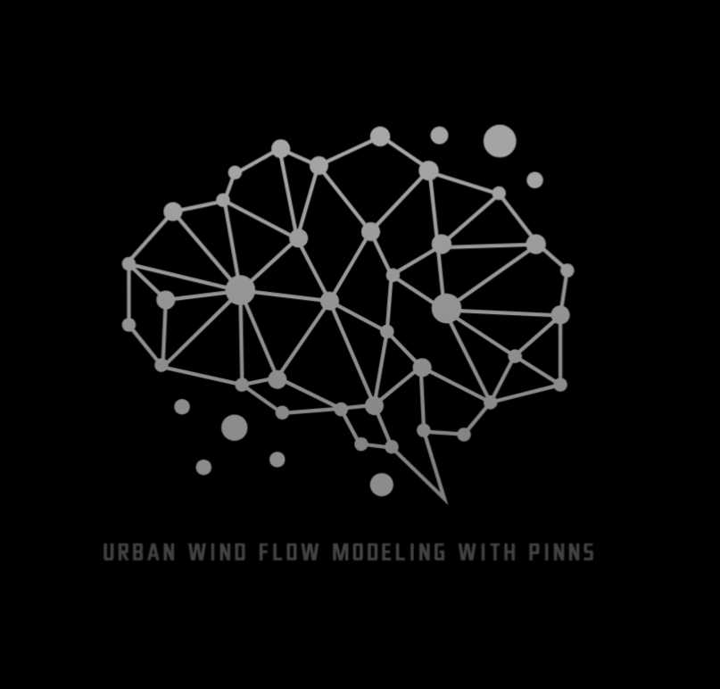

<!-- PROJECT LOGO -->

  WIP

 

    
  <h3 align="center">Urban Wind Flow Modeling with PINNs</h3>
  
IAAC: AI 2023-24 
    <a href="mailto:andres.roncal@students.iaac.net" target="_blank">Report Bug</a>
    ·
    <a href="mailto:andres.roncal@students.iaac.net" target="_blank">Request Feature</a>
  

  <!-- Add a link to the research paper -->
  

    <a href="https://docs.google.com/document/d/1bncJg6RVQCD4ev0K-jJk0_dyS2iHdrlpaUodtdLf9TM/edit" target="_blank">
      View Research Paper
    </a>
  

<!-- GIF Section -->

  

<h2>About The Project</h2>

This project was developed as part of the IAAC: AI 2023-24 course, focusing on creating an open-source, web-based platform to simulate urban wind flow using Physics-Informed Neural Networks (PINNs). The simulation utilizes real-time and historical data, integrating models with neural network computations to visualize pedestrian comfort and promote sustainable urban planning.

<h3>Overview</h3>

The project integrates real-time wind data from OpenWeatherMap and 3D building models from OpenStreetMap to simulate urban wind patterns using PINNs. The process includes setting up a backend for data processing, developing and training a PINN model using NVIDIA Modulus, and designing a Vue.js-based frontend for real-time interaction and visualization.

<h3>Objectives</h3>

This project aims to provide an accessible tool for urban planners, architects, and researchers to simulate urban wind flow and make data-driven decisions in urban design:

<ul>
  <li>Collect and preprocess data from various sources, including NOAA, OpenWeatherMap, and OpenStreetMap.</li>
  <li>Develop and train a Physics-Informed Neural Network (PINN) model using NVIDIA Modulus and PyTorch to simulate wind flow.</li>
  <li>Integrate the trained model into a Vue.js application for real-time interaction and visualization of results.</li>
  <li>Provide insights into enhancing pedestrian comfort and sustainable urban design by utilizing data-driven simulations.</li>
  <li>Foster a collaborative and open-source approach, inviting community contributions to enhance the platform's capabilities.</li>
</ul>

<h3>Significance</h3>

The project's significance lies in its ability to reduce reliance on mechanical cooling systems and improve outdoor conditions, thereby promoting sustainability in urban environments. By providing an accurate and real-time analysis of urban wind flow, it supports efforts to design energy-efficient cities and improve the quality of urban life.

<h3>Project Timeline</h3>

<ol>
  <li><strong>Setup and Requirements</strong>: Set up WSL (Windows Subsystem for Linux) to access GPU resources efficiently. Defined the project's scope, focusing on integrating real-time data sources like NOAA and OpenWeatherMap, while selecting a technology stack that includes Vue.js, Flask/FastAPI, TensorFlow, PyTorch, and NVIDIA Modulus for PINN simulations.</li>
  <li><strong>Planning and Research</strong>: Conducted extensive research on Physics-Informed Neural Networks (PINNs) and fluid dynamics. Experimented with NVIDIA Modulus, PyTorch, and DeepXDE to explore modeling approaches. Organized the GitHub repository to track progress, ensuring a well-structured codebase for future development.</li>
  <li><strong>Repository and UI Development</strong>: Created a clear folder hierarchy in the repository to store documentation, code, and data. Utilized GitHub's issue tracking and timeline features for managing project milestones. Developed the initial API using Flask/FastAPI for handling real-time weather and geometry data.</li>
  <li><strong>Model Integration and Testing</strong>: Focused on integrating complex simulations using NVIDIA Modulus and PINNs. Conducted multiple tests, including attempts to fit OpenStreetMap building polygons into the heat sink model. Worked on configuring domain constraints to accurately represent urban environments in the simulations. Although initial tests were not fully successful, this phase deepened the understanding of adapting PINNs for real-world applications.</li>
  <li><strong>Learning and Bootcamps</strong>: Engaged in a series of tutorials and bootcamps to acquire certification in PINN simulations. Explored advanced techniques such as Inverse PINNs (I-PINNs) and Deep Neural Operators (DeepONets) using NVIDIA Modulus, significantly enhancing the knowledge required for complex fluid dynamics simulations.</li>
  <li><strong>Current Status and Future Steps</strong>: Successfully integrated both front-end and back-end components, facilitating real-time wind simulations and 3D visualizations. The next steps involve refining the pedestrian wind assessment model, incorporating additional environmental factors like temperature and humidity, and exploring further optimizations for computational efficiency.</li>
</ol>

<h3>Methodology</h3>

<ol>
  <li><strong>Planning</strong>: Set up the repository, outlined the project's scope, and identified necessary data sources (NOAA, OpenWeatherMap, OpenStreetMap). Decided on the technology stack (Vue.js, Flask/FastAPI, NVIDIA Modulus, PyTorch).</li>
  <li><strong>PINN Model Development</strong>: Developed a Physics-Informed Neural Network model using NVIDIA Modulus. Integrated the OpenStreetMap building polygons into the model by extracting edge points and simplifying building blocks into solids. Attempted different domain constraints to align footprints within the simulation space.</li>
  <li><strong>Backend Development</strong>: Built the backend using Flask/FastAPI to handle data processing and run simulations. Developed API endpoints to fetch real-time weather data and integrate building geometry data from OpenStreetMap.</li>
  <li><strong>Frontend Development</strong>: Developed the UI using Vue.js. Utilized Three.js for 3D rendering of urban geometries and Geolib for geographical calculations. Implemented user controls for inputting geographical data and visualizing simulation results.</li>
  <li><strong>Testing and Integration</strong>: Connected the frontend, backend, and PINN model, conducting multiple tests to ensure reliable wind flow simulations. Encountered challenges in integrating OpenStreetMap data accurately within the PINN model, leading to additional learning phases.</li>
  <li><strong>Deployment</strong>: Prepared the application for cloud deployment. Documented the project's codebase, methodologies, and best practices to facilitate future development and community collaboration.</li>
</ol>

<h3>Data Sources</h3>

<ul>
  <li><strong>Real-Time Wind Data</strong>: Acquired from OpenWeatherMap API for current atmospheric conditions.</li>
  <li><strong>3D Building Models</strong>: Extracted from OpenStreetMap using the Overpass API to simulate the urban geometry accurately.</li>
</ul>

<h3>Equations and Models</h3>

Integrated Navier-Stokes and Advection-Diffusion equations within the neural network model using NVIDIA Modulus. Challenges included extracting and simplifying building footprints into polygons, moving them to appropriate coordinates, and setting up the simulation domain to interact correctly with the building geometries.

<!-- GIF Section -->

  

<h3>Frontend Development</h3>

The frontend interface, developed using Vue.js, Three.js, and Geolib, allows users to input geographical coordinates, run wind flow simulations, and visualize real-time results. The interface also provides additional environmental layers, such as temperature and humidity, to support a comprehensive analysis of urban wind patterns.

<h3>System Integration</h3>

Successfully integrated the backend (Flask/FastAPI), frontend (Vue.js, Three.js), and PINN model components. Developed a helper file for definitions and configurations. Although integrating OpenStreetMap building footprints into the simulation presented challenges, these were addressed through iterative model testing and learning phases.

<h3>Learning and Development with NVIDIA Modulus</h3>

Throughout the project, various PINN tutorials and NVIDIA Modulus bootcamps were completed to gain a deeper understanding of fluid dynamics modeling. These learning activities included:

<ul>
  <li><strong>Physics-Informed Neural Networks (PINNs)</strong>: Integrated physical laws into neural networks for simulation accuracy.</li>
  <li><strong>Inverse PINNs (I-PINNs)</strong>: Tackled inverse problems to optimize model parameters based on real-world data.</li>
  <li><strong>Deep Neural Operators (DeepONets)</strong>: Explored advanced simulations using neural operators to solve complex fluid dynamics problems.</li>
</ul>

    

<h3>Current Status and Next Steps</h3>

The platform currently supports real-time wind simulations and 3D visualizations. Upcoming steps include:

<ul>
  <li>Refining the pedestrian wind assessment model.</li>
  <li>Incorporating additional environmental factors such as temperature and humidity.</li>
  <li>Enhancing computational efficiency and accuracy for large-scale simulations.</li>
</ul>

<h2>Project Structure</h2>

<ul>
  <li><code>src/</code>: Source files for the Vue.js frontend and simulation scripts.</li>
  <li><code>public/</code>: Public assets, including images, logos, and GIFs.</li>
  <li><code>package.json</code>: Project dependencies and configurations.</li>
  <li><code>README.md</code>: Documentation outlining project objectives, methods, and instructions.</li>
</ul>

<h2>Team & Contacts</h2>

<h3>Contributor</h3>

<strong>Andres Roncal</strong>

<h3>Thesis Advisor</h3>

<strong>David Andres Leon</strong>

(<a href="#readme-top">back to top</a>)

</html>
